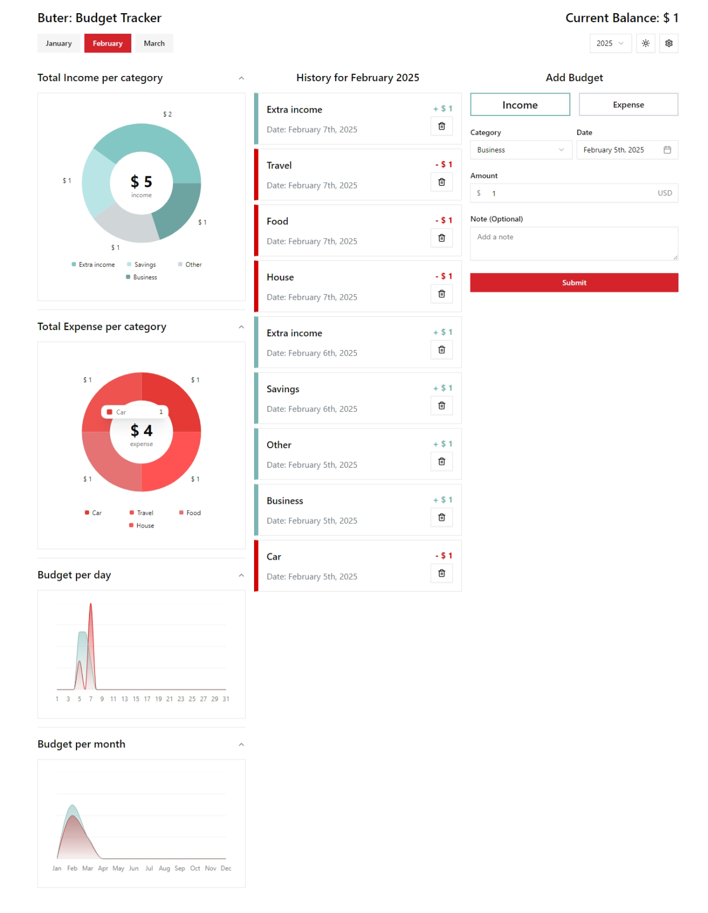

# Buter - Budget Tracker Application

## Introduction

The **Budget Tracker Application** is a financial management tool designed to help users track their income and expenses efficiently. The application provides insightful visualizations using Pie Charts and Area Charts to analyze spending patterns and financial trends over time.

## [Live View](https://hadiatabdulbashit.github.io/buter)

## Features

- **Pie Chart Visualization**: Displays categorized budget data based on selected month and year.
- **Area Chart Analysis**: Shows income and expense trends on a daily and monthly basis.
- **Local Storage Support**: Budget data is stored locally for easy access and management.
- **Dynamic Filtering**: Users can filter budget data by month and year.
- **Intuitive UI**: Built with modern UI components for an enhanced user experience.
- **Setting**: Personalize ui with self setting configuration

## Installation

### Prerequisites

Ensure you have the following installed on your system:

- **Bun** or **Node.js**
- **Git** (optional, for cloning the repository)

### Steps to Install

1. **Clone the repository**:
   ```sh
   git clone https://github.com/HadiatAbdulBashit/buter.git
   cd buter
   ```
2. **Install dependencies**:
   ```sh
   bun install
   # or
   npm install
   ```
3. **Start the application**:
   ```sh
   bun dev
   # or
   npm run dev
   ```
4. Open your browser and navigate to:
   ```
   http://localhost:5173
   ```

## Usage

### Adding Budget Data

- The application retrieves and stores budget data from `localStorage`.
- Users can input income and expense transactions categorized by type.
- The data is automatically updated in the charts.

### Viewing Reports

- **Pie Chart**: Displays a breakdown of expenses by category.
- **Area Chart**:
  - **Daily View**: Shows financial trends for selected dates.
  - **Monthly View**: Compares income and expenses over different months.

## Technologies Used

- **React.js**: Frontend framework
- **Recharts**: Data visualization library
- **Tailwind CSS**: Styling framework
- **LocalStorage**: Data persistence
- **Shadcn UI**: Component

## Screenshot


